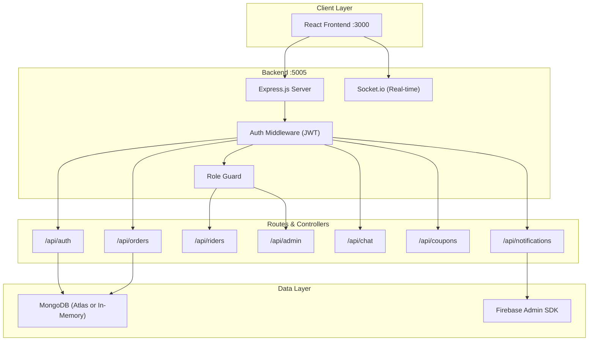

# QuickDrop Backend — Complete Walkthrough

## ✅ Status: Fully Implemented & Running

Your backend is **already fully implemented** and matches the [Backend Master Prompt](file:///d:/Software%20Development%20Project/SEMESTER-PROJECT/QuickDrop_Backend_Master_Prompt.md) specification. Here's a breakdown of everything that's in place.

---

## Architecture Overview

---

## File Structure (All Files Present ✅)

| File | Purpose | Status |
|------|---------|--------|
| [server.js](file:///d:/Software%20Development%20Project/SEMESTER-PROJECT/backend/src/server.js) | Express + Socket.io entry point | ✅ |
| [db.js](file:///d:/Software%20Development%20Project/SEMESTER-PROJECT/backend/src/config/db.js) | MongoDB connection + auto-seed | ✅ |
| [auth.js (middleware)](file:///d:/Software%20Development%20Project/SEMESTER-PROJECT/backend/src/middleware/auth.js) | JWT `protect` middleware | ✅ |
| [roleGuard.js](file:///d:/Software%20Development%20Project/SEMESTER-PROJECT/backend/src/middleware/roleGuard.js) | Role-based access control | ✅ |
| [pricing.js](file:///d:/Software%20Development%20Project/SEMESTER-PROJECT/backend/src/utils/pricing.js) | Fare calculation utility | ✅ |

### Models (6/6 ✅)

| Model | File | Key Fields |
|-------|------|------------|
| User | [User.js](file:///d:/Software%20Development%20Project/SEMESTER-PROJECT/backend/src/models/User.js) | name, email, password, phone, role, isBlocked, fcmToken |
| Rider | [Rider.js](file:///d:/Software%20Development%20Project/SEMESTER-PROJECT/backend/src/models/Rider.js) | name, email, password, vehicleType, isAvailable, totalEarnings |
| Order | [Order.js](file:///d:/Software%20Development%20Project/SEMESTER-PROJECT/backend/src/models/Order.js) | user, rider, pickup/dropoff, parcelType, price, status |
| Message | [Message.js](file:///d:/Software%20Development%20Project/SEMESTER-PROJECT/backend/src/models/Message.js) | order, senderId, senderModel, text |
| Coupon | [Coupon.js](file:///d:/Software%20Development%20Project/SEMESTER-PROJECT/backend/src/models/Coupon.js) | code, discountType, discountValue, maxUses, expiryDate |
| Notification | [Notification.js](file:///d:/Software%20Development%20Project/SEMESTER-PROJECT/backend/src/models/Notification.js) | recipientId, recipientType, title, body, isRead |

### Controllers (7/7 ✅)

| Controller | File |
|------------|------|
| authController | [authController.js](file:///d:/Software%20Development%20Project/SEMESTER-PROJECT/backend/src/controllers/authController.js) |
| orderController | [orderController.js](file:///d:/Software%20Development%20Project/SEMESTER-PROJECT/backend/src/controllers/orderController.js) |
| riderController | [riderController.js](file:///d:/Software%20Development%20Project/SEMESTER-PROJECT/backend/src/controllers/riderController.js) |
| adminController | [adminController.js](file:///d:/Software%20Development%20Project/SEMESTER-PROJECT/backend/src/controllers/adminController.js) |
| chatController | [chatController.js](file:///d:/Software%20Development%20Project/SEMESTER-PROJECT/backend/src/controllers/chatController.js) |
| couponController | [couponController.js](file:///d:/Software%20Development%20Project/SEMESTER-PROJECT/backend/src/controllers/couponController.js) |
| notificationController | [notificationController.js](file:///d:/Software%20Development%20Project/SEMESTER-PROJECT/backend/src/controllers/notificationController.js) |

---

## Complete API Reference

### 🔐 Auth (`/api/auth`)

| Method | Endpoint | Auth | Description |
|--------|----------|------|-------------|
| `POST` | `/register` | ❌ | Register a new customer |
| `POST` | `/login` | ❌ | Customer login |
| `POST` | `/rider/register` | ❌ | Register a new rider |
| `POST` | `/rider/login` | ❌ | Rider login |
| `POST` | `/google-login` | ❌ | Google OAuth sign-in |
| `GET` | `/profile` | ✅ | Get authenticated profile |
| `PATCH` | `/profile-pic` | ✅ | Update profile picture (base64) |
| `PATCH` | `/profile-details` | ✅ | Update phone/address |
| `PATCH` | `/fcm-token` | ✅ | Update FCM push token |
| `POST` | `/update-fcm-token` | ✅ | Alias for FCM token update |
| `PATCH` | `/rider/nid` | ✅ | Upload NID image (base64) |

### 📦 Orders (`/api/orders`)

| Method | Endpoint | Auth | Description |
|--------|----------|------|-------------|
| `POST` | `/` | ✅ | Create order (with offline dedup & coupon) |
| `GET` | `/` | ✅ | Get my orders |
| `POST` | `/price` | ✅ | Calculate fare dynamically |
| `GET` | `/:id` | ✅ | Get order by ID |
| `PATCH` | `/:id/cancel` | ✅ | Cancel a pending order |

### 🏍️ Riders (`/api/riders`) — Rider-only

| Method | Endpoint | Description |
|--------|----------|-------------|
| `GET` | `/profile` | Get rider profile |
| `GET` | `/pending` | Get unassigned orders |
| `GET` | `/deliveries` | Get my deliveries |
| `GET` | `/earnings` | Get earnings summary |
| `PATCH` | `/availability` | Toggle available status |
| `PATCH` | `/:id/accept` | Accept an order |
| `PATCH` | `/:id/status` | Update order status (enforced flow) |

### 🛡️ Admin (`/api/admin`) — Admin-only

| Method | Endpoint | Description |
|--------|----------|-------------|
| `GET` | `/dashboard` | KPI aggregates |
| `GET` | `/analytics` | Revenue/order trends + status distribution |
| `GET` | `/leaderboards` | Top riders & top spenders |
| `GET` | `/top-riders` | Top 5 riders by deliveries |
| `GET` | `/orders` | All orders (paginated, filterable) |
| `GET` | `/users` | All users (searchable, with order count) |
| `GET` | `/riders` | All riders (searchable) |
| `POST` | `/riders` | Create a rider |
| `DELETE` | `/riders/:id` | Delete a rider |
| `PATCH` | `/users/:id/block` | Toggle block user |
| `PATCH` | `/riders/:id/block` | Toggle block rider |
| `PATCH` | `/orders/:id/status` | Override any order status |

### 💬 Chat (`/api/chat`)

| Method | Endpoint | Auth | Description |
|--------|----------|------|-------------|
| `GET` | `/:orderId` | ✅ | Get chat history for an order |
| `POST` | `/:orderId` | ✅ | Send a message (+ FCM push) |

### 🎟️ Coupons (`/api/coupons`)

| Method | Endpoint | Auth | Description |
|--------|----------|------|-------------|
| `POST` | `/` | Admin | Create coupon |
| `GET` | `/` | Admin | List all coupons |
| `DELETE` | `/:id` | Admin | Delete coupon |
| `POST` | `/validate` | ✅ | Validate a coupon code |

### 🔔 Notifications (`/api/notifications`)

| Method | Endpoint | Auth | Description |
|--------|----------|------|-------------|
| `POST` | `/send` | Admin | Broadcast push notification |
| `GET` | `/my` | ✅ | Get my notification inbox |
| `PATCH` | `/read/:id` | ✅ | Mark as read (or `:id` = `all`) |
| `DELETE` | `/:id` | ✅ | Delete (or `:id` = `all`) |

### 🏥 Utility

| Method | Endpoint | Auth | Description |
|--------|----------|------|-------------|
| `GET` | `/api/health` | ❌ | Health check |
| `GET` | `/api/force-seed` | ❌ | Force re-seed the database |

---

## Real-Time (Socket.io) ✅

The server handles three socket events:

| Event | Direction | Purpose |
|-------|-----------|---------|
| `join_order_room` | Client → Server | Join a room for an order's updates |
| `join_user_room` | Client → Server | Join a room for user notifications |
| `send_message` | Client → Server | Send a chat message |
| `receive_message` | Server → Client | Broadcast received message to room |
| `order_status_update` | Server → Client | Broadcast status change to room |
| `new_notification` | Server → Client | Real-time notification push |

---

## Database & Seeding ✅

The [db.js](file:///d:/Software%20Development%20Project/SEMESTER-PROJECT/backend/src/config/db.js) has a 3-tier connection strategy:

1. **Try MongoDB Atlas** (from `MONGO_URI` env)
2. **Fallback → In-memory MongoDB with persistent storage** (`.mongo-persist/`)
3. **Final fallback → Ephemeral in-memory MongoDB**

On empty database, `autoSeedIfEmpty()` creates:
- **8 users** (1 admin + 7 customers)
- **5 riders** (motorcycle, car, bicycle)
- **80 random orders** (various statuses)
- **3 coupons** (WELCOME50, FLAT100, FESTIVAL20)

---

## Test Credentials 🔑

| Role | Email | Password |
|------|-------|----------|
| **Admin** | `admin@quickdrop.com` | `admin1234` |
| **User** | `mohiul@test.com` | `test1234` |
| **Rider** | `rubel@rider.com` | `test1234` |

---

## Summary

> [!TIP]
> **Your backend is 100% implemented.** All 7 route groups, 7 controllers, 6 models, 2 middleware, Socket.io real-time, Firebase push notifications, coupon system, and auto-seeding are fully in place and running on port 5005.

The `Cannot GET /` message on `http://localhost:5005/` is expected — the backend is a pure REST API and doesn't serve HTML. Use `http://localhost:3000/` for the frontend UI, or test APIs via tools like Postman/curl.
