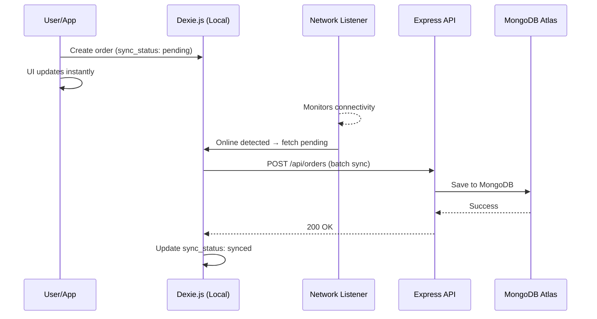

# QuickDrop — Project Plan & Folder Structure

## Full Project Structure

```
SEMESTER-PROJECT/
├── backend/                          # Node.js + Express API
│   ├── src/
│   │   ├── config/
│   │   │   └── db.js                 # MongoDB connection
│   │   ├── middleware/
│   │   │   ├── auth.js               # JWT verification middleware
│   │   │   └── roleGuard.js          # Role-based access control
│   │   ├── models/
│   │   │   ├── User.js               # User schema
│   │   │   ├── Rider.js              # Rider schema
│   │   │   └── Order.js              # Order schema
│   │   ├── routes/
│   │   │   ├── auth.js               # Login/Signup routes
│   │   │   ├── orders.js             # Order CRUD + status updates
│   │   │   ├── riders.js             # Rider-specific routes
│   │   │   └── admin.js              # Admin dashboard routes
│   │   ├── controllers/
│   │   │   ├── authController.js     # Auth logic
│   │   │   ├── orderController.js    # Order logic
│   │   │   ├── riderController.js    # Rider logic
│   │   │   └── adminController.js    # Admin logic
│   │   ├── utils/
│   │   │   └── pricing.js            # Price calculation engine
│   │   └── server.js                 # Express entry point
│   ├── .env                          # Environment variables
│   └── package.json
│
├── frontend/                         # React + Vite PWA
│   ├── public/
│   │   ├── manifest.json             # PWA manifest
│   │   └── sw.js                     # Service worker
│   ├── src/
│   │   ├── components/               # Reusable UI components
│   │   ├── pages/
│   │   │   ├── user/                 # User panel pages
│   │   │   ├── rider/                # Rider panel pages
│   │   │   └── admin/                # Admin panel pages
│   │   ├── hooks/                    # Custom React hooks
│   │   ├── services/
│   │   │   ├── api.js                # Axios/fetch config
│   │   │   └── dexieDb.js            # Dexie.js local DB
│   │   ├── context/                  # Auth & app context
│   │   ├── utils/                    # Helper functions
│   │   ├── App.jsx
│   │   ├── main.jsx
│   │   └── index.css                 # Tailwind entry
│   ├── index.html
│   ├── tailwind.config.js
│   ├── vite.config.js
│   └── package.json
│
└── README.md
```

---

## Phase 1 Deliverables

| # | Item | Status |
|---|------|--------|
| 1 | Backend `npm init` + dependencies | 🔲 |
| 2 | MongoDB connection config | 🔲 |
| 3 | User, Rider, Order Mongoose schemas | 🔲 |
| 4 | JWT auth middleware | 🔲 |
| 5 | Auth routes (signup/login) | 🔲 |
| 6 | Order routes (CRUD + status) | 🔲 |
| 7 | Rider routes | 🔲 |
| 8 | Admin routes | 🔲 |
| 9 | Pricing utility | 🔲 |

---

## Architecture: Offline-Sync Flow


